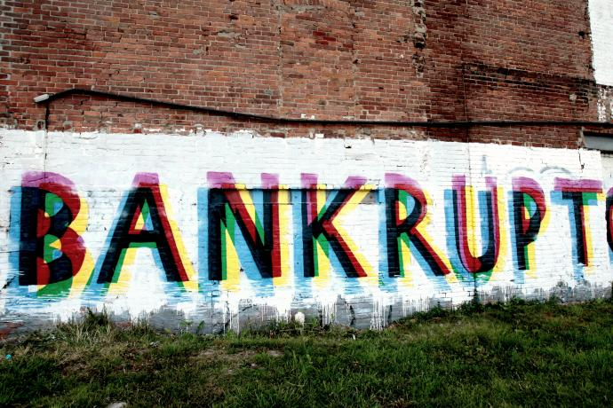
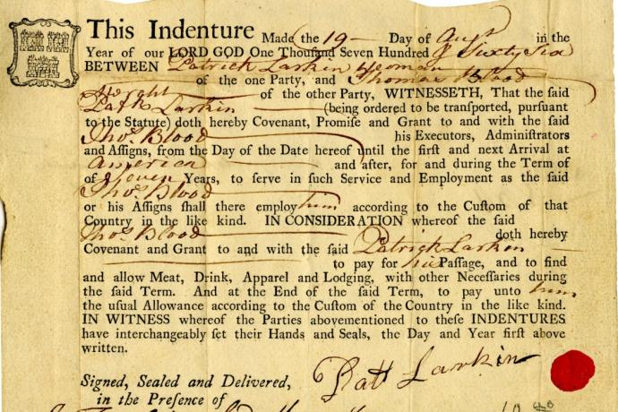
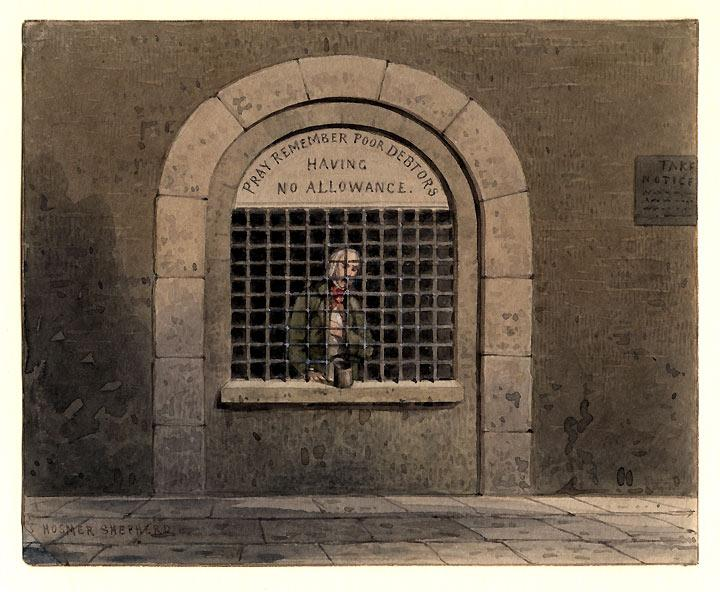

Credit and debt are more than just rational material exchanges within a market economy. They are socially constructed and center on matters of hard moral judgments about character, equity, and “good conscience.” These judgments are, in turn, bound up with powerful emotions of resentment, shame, and humiliation. Changing and conflicting representations of personal credit and debt deeply affect the power and welfare of states.

## Debt Slavery

A diversity of social meanings has been attached to debt over time. And yet certain patterns do recur. In various European languages debt co-occurs with “bondage,” “freedom,” “gratitude,” and “honor,” as in “freedom from debt,” “debt of gratitude,” and “debt of honor.”

In Dutch and German, the word _Schuld_ means both debt and guilt. A similar linguistic association is found in the Hebrew word _Chayav_. These terms illustrate the deep-seated cultural anxiety attached to debt and the powerful feelings of shame it can provoke. For Germans, the fabled Swabian housewife is the traditional cultural icon of virtuous economic conduct: One should “live within one’s means.” German Chancellor Angela Merkel appropriated this icon in justifying her policies regarding the post-2010 euro area sovereign debt crises.

Reflecting his German context, Friedrich Nietzsche offered an anthropological account of the historical association of guilt with indebtedness (_das Schuldgefühl_). He stressed that debt was bound up with the moralization of concepts of duty, honor, self-esteem, and standing. In _On the Genealogy of Morals_, Nietzsche looked back to the “oldest and most primitive” personal relationship between creditor and debtor as the origin of how “one person first measured himself against another.”

Indeed, credit and debt did pre-date money. They took the form of favors among friends and neighbors, which created personal moral obligations. Later, the creation of money provided a unit of account for keeping track of debts. More importantly, it led to a de-personalization of creditor-debtor relations, making commercial society possible. This evolution was bound up with the innovation of posting and exacting collateral. In this way, debt became bound up with the threat, and often reality, of the erosion of freedom, not just for individuals but for entire families. They found themselves in a condition of “debt slavery.”

Because of the connotation of enslavement, revolutionary changes of power, or the accession of new rulers, frequently brought with them debt cancellations and destruction of debt records. The first recorded example of this appears to be in 2400 BC by King Enmetena in the Sumerian city-state of Lagash in Mesopotamia. Thereafter, the biblical proverb “The rich rules over the poor, and the borrower is servant to the lender” was used to justify the cancellation of “odious” debts after regime change. It was also used in condemnation of debtors’ prisons, for instance in the works of Charles Dickens.

From the eighteenth century onward, there were two main catalysts for rethinking notions of debt. The first was the rise of a new commercial society, which was associated with property rights and the multiplication of contractual relations, encouraged above all by the use of collateral to expand credit. Parties normally ineligible to borrow were able to enter into credit transactions. The consequence was a society in which creditor–debtor relations assumed central social and political significance, represented by an aspiring merchant-financier class, rentiers, and newly self-confident professions of accountancy and law.

The second catalyst for rethinking debt was the birth and huge increase in public debt. This transformation opened up the question of whether this development was a force for good or ill. In France, for example, the ruinous French royal finances in the eighteenth century had a profound effect on economic thinking. The French philosopher Montesquieu expressed his anxiety in _The Spirit of the Laws_. Public debt, he wrote, “takes the true revenue of the state from those who have activity and industry, to convey it to the indolent: that is, it gives facilities for labor to those who do not work, and clogs with difficulties those who do work.”

Meanwhile, the Scottish thinkers David Hume and Adam Smith feared that the seductions of public debt were corrupting states and generating a politics of illusion and hubris. Public debt financing facilitated ruinous wars in Europe and underpinned the vain pursuit of empire in the Atlantic, the Mediterranean, and India. It also enlarged political patronage, creating a mutual dependence between states and creditors that led to oligarchy and factionalism and risked the collapse of public virtue.

The debate about whether public debt promoted the virtues of commerce or the vice of profligacy was also at the heart of the acrimonious dispute between Alexander Hamilton and Thomas Jefferson in the wake of the U.S. War of Independence. In the name of virtue, Jefferson attacked Hamilton’s pursuit of public debt financing, commercial empire, and executive patronage. He argued that the priority should be to freeing the new nation of debt. In an 1809 letter to the U.S. Secretary of the Treasury Albert Gallatin, Jefferson claimed:

> There does not exist an engine so corruptive of the government and so demoralizing of the nation as a public debt. It will bring on us more ruin at home than all the enemies from abroad against which this army and navy are to protect us.

From the mid-nineteenth century on, though the emerging German historical and institutional school of economics took a very different view of public debt from that of Montesquieu, Hume, Smith, and Jefferson. They were united in the view that public debt was an integral part of national economies. The thinkers Karl Dietzel and Lorenz von Stein believed that the state had a positive role to play in balancing the economy, above all by financing productivity-enhancing investment in infrastructure and public provision. Dietzel, for one, argued that, “A nation is so much the richer and its national economy so much more blossoming and progressing, the greater the ratio of interest payments on government bonds in total government outlays is.” And, for his part, Stein stressed the role of public debt as collective insurance, above all in helping provide for old age, and thus in promoting social and political integration. However, he became aware that public debt could be politically abused to finance current consumption rather than productivity-enhancing investment. Hence, Stein called for a constitutional safeguard against this misuse, a form of “golden rule” in public finances later taken up in the Basic Law of the German Federal Republic.

The belief in the usefulness of debt seemed to triumph over Montesquieu, Hume, Smith, and Jefferson’s aversions. Levels of public debt of over 100 percent of GDP were far from exceptional in the nineteenth and twentieth centuries. Political economy changed profoundly as new social forces entered the political arena. Public debt grew with the radical transformation of the technology, scale, and conduct of war. New communication technologies enabled cross-nationally mobile credit. And the concentrated structure of financial markets made public balance sheets more vulnerable to big banking crises.

That vulnerability only grew with new private-sector technologies of credit creation. In addition, the secularization of society eroded attachment to inherited religious and folk beliefs about debt. It was accompanied by new belief in the scientific management of public finances, including creative financial engineering. These factors combined to facilitate the emergence of new, less constraining ideologies of debt. Gone were the days in which, intellectually, the dominant role of prudence or practical wisdom in reasoning about virtuous private and public conduct acted as an inhibition on debt.

A key aspect of this revolution was the increasingly abstract nature of money. The German author Johann Wolfgang von Goethe gave dramatic expression to the loosening sense of guilt that was associated with the move to fiat currency. In _Faust_ Part Two, Mephistopheles advises the Holy Roman Emperor:

> Such paper, in the place of actual gold, is practical: we know just what we hold...But wise men will, when they have studied it, place infinite trust in what is infinite.

By the late twentieth century, the loosening of the sense of constraint and guilt attached to debt took a radically new form. Consumers and investors could make use of electronic money. The age of cyberfinance reshaped attitudes toward credit: “Money is now endless,” the economist Satyajit Das wrote in _Extreme Money_, “capable of infinite multiplication and completely unreal.” It also created a widespread sense of confusion, unease, and alarm about the implications for the behavior of banks and for how central banks managed money, for instance quantitative easing.

The implications of decline in prudence became ever more serious with the huge growth in the scale of financial assets; with the size, complexity, and opacity of the financial institutions managing these assets; and with the proliferation of ever-more exotic credit instruments, like securitization and collateralized debt obligations. Science-based models induced the illusion that credit risks were better controlled. And the ease of credit creation enabled hubris on a historically new scale.

Changes in attitudes to debt and risk were also bound up with new discourses about social entitlement. Consumer expectations of ever-higher living standards were fuelled by more lenient and readily available bank lending, the subsequent booms in construction and property market sectors, and the expansion of retail sectors, modern advertising, and marketing. Social status and identity became closely associated with consumption, in particular with the concept of luxury. Identifying oneself with the good life meant being able to live beyond traditional understandings of basic needs. Debt was the price one paid for the joys of being part of a hedonistic consumer culture. Its denial had the potential to foster a deep sense of loss, despair, social protest, and riot.

Twentieth-century discourse illustrated the profound moral ambiguities associated with debt—and the associated difficulties in framing and using state power. On the one hand, social entitlement, market society, hedonistic consumer culture, and neo-Keynesian economics suggest that the old idea of prudence had been fully dethroned. On the other hand, the notion that the state is “the household writ large” retained a continuing hold on popular imagination. The portrayal of political leaders and parties as feckless in managing public finances, as presiding over excessive public debt, and as in collusion with over-powerful bankers, invited electoral punishment. Evidence suggests that aligning oneself with debt reduction attracts broad public support. Despite neo-Keynesian macroeconomic insights, and modern consumer, financial, and promotional cultures, states still occupy a political world in which folk beliefs about debt retain a strong hold on how leaders behave. The more practical problem stems from the paradox that, although voters want action to tackle debt in the aggregate, few are ready to accept the ensuing consequences.

## Morality and Debt

How far, and in what ways, is debt “bad”? What is the appropriate behavior of both creditors and debtors? What is the proper balance between, on the one hand, systemic stability and collective solidarity and, on the other, avoidance of moral hazard in managing sovereign debt? Who are the innocent victims and who, in the interests of fairness, should bear the fiscal pain of macroeconomic adjustment? How far should institutional feasibility define and, if necessary, restrict responsibility?

At the heart of many of these questions is the way in which creditor-debtor relations form a dyad. There cannot be creditors without debtors, any more than “surplus” states without “deficit” states in trade. In short, although their relationship is unequal, creditors need debtors. Moral ambiguity—and the absence of easy political solutions—originates from the problem of balancing the claims of creditors to superior virtue and uniqueness with those of debtors for recognition and honor. It can, in principle, be addressed by procedural rules that bridge different moral positions and overcome power differentials. In their absence, there is high risk of grievance, harassment, despair, and victimhood.

Credible commitment to such procedural rules depends on creditors’ recognition that adjustments cannot be made by debtors alone. The political difficulties lie in how to get each to face up to the implications of the mutual, asymmetric dependence of creditor and debtor states. Their relationship has features of a prisoners’ dilemma, in which neither side can defect without causing serious damage to the other. Managing this dilemma is easier when the institutional conditions are in place to help sustain an evolutionary, stable pattern of conditional cooperation. As with the euro area, a set of rules of the game that encourage repeated interaction induce cooperation. However, risks remain. Creditor-state elites retain a paramount interest in limiting their liability. Moreover, one, or both parties, faced with deeply unpalatable choices, may choose to pursue a game of chicken, in which the bluff of the other is called. And, miscalculation can have high costs for all.

The politics of creditor–debtor relations are exacerbated by a moralizing language of “saints” and “sinners,” which is laced with feelings of pride in national virtue, on the one side, and of shame, humiliation, and resentment, on the other. Esoteric technical vocabulary and efforts to construct inclusive processes of debate and negotiation cannot hide the extent to which the idea of sovereign creditworthiness is a world of identities and symbolism, to which powerful, historically grounded, and often idiosyncratic feelings are attached.

Qualitative advancement in thinking about creditor-debtor relations and sovereign creditworthiness thus depends on strengthening their ethical dimension and promoting cultural change in two ways.

First, analysis of sovereign creditworthiness needs to move beyond a narrow, utilitarian, and financial view of balance sheets. It must also examine outcomes from longer-term and society-wide perspectives. This more expansive view involves taking account of wider expectations with respect to governance, social welfare, and environmental quality. A critical reexamination of sovereign creditworthiness reveals ethical questions about the operation and power of financial markets, including the net social value of financial innovations like derivatives and securitization.

Deep analysis suggests changes in the functioning of financial markets, including credit rating agencies, to reduce conflicts of interest, increase transparency, and avert excessive risk-taking through financial instruments of questionable net social value. One option is to rely on improvements in internal governance within financial markets. Examples include changes within credit rating agencies and greater accountability of managers for long-run performance, notably by changes to bank bonus practices. However, Turkeys do not vote for Thanksgiving, to paraphrase the British saying. External pressure from supervisors and regulators is required.

Secondly, there need to be corrections to the political short-sightedness that so often bedevils—and raises the costs—of debt crises. Political leaders of creditor states have great difficulties in persuading their domestic political elites and publics to make short-term sacrifices as taxpayers for long-term gains from avoidance of debt default and the systemic risks that follow. This problem is greater when it involves rescuing states, such as Greece and Cyprus, that are judged to be plagued by endemic corruption and failing governance capacity.

Within the euro area, the German federal government hesitated over the Greek bailout for some four months from January-February 2010, till after key elections. The German media was littered with images of lazy, corrupt, and featherbedded Greeks, enjoying pensions much earlier than Germans. They portrayed a bloated, privileged Greek public sector of unknown dimensions. These images ignored the reckless lending by German and other EU banks to Greece. In the end, German hesitation contributed to higher final costs of the eurozone-IMF bailout in May 2010. Political leadership is a tough call when it seeks to reframe moral arguments in terms that more judiciously apportion blame. As the Greek crisis gathered momentum in 2011–12, German political leadership instead resorted to dramatization of the existential threat to the eurozone and the European Union in order to overcome the deep reluctance of elite and public opinion to shoulder the costs of further financial assistance.

Better management of sovereign debt crises, though, goes to the heart of the functioning of liberal democracies. Current practices highlight the risks of disconnection between, on the one hand, domestic political competition and electoral choices and, on the other, policies to restore sovereign creditworthiness that are negotiated or imposed internationally. Disconnection is revealed in the growth of popular alienation from conventional forms of politics. In this context, space opens for populist political mobilization against external diktat, benefitting far Left and far Right parties. This phenomenon was apparent in the electoral performance of the National Front in the French Presidential and Assembly elections of 2012, of Syriza in the two Greek elections of 2012, and of the Five-Star Movement in the Italian elections of 2013.

## The Reckless, The Feckless, and The Innocent 

Creditors are prone to be seen as “saints,” debtors as “sinners.” Virtue is attached to the former (prudence, hard work), and vice to the latter (fecklessness, laziness). This kind of language puts at stake dignity, honor, and mutual respect. It arouses base as well as noble emotions, including resentment, grievance, and rage. The moral and emotional dimensions of debt are intimately intertwined.

To be effective, those managing sovereign debt crises have to be acutely sensitive to this powerful psychological dimension. Otherwise, those on the receiving end of punitive adjustments will mobilize to express their outrage. Building credibility in sovereign bond markets became mainstream in macroeconomic theory after the 1970s: What mattered for sovereign creditworthiness was management of market expectations, a key element of which was financial market psychology. States had to restore their credibility by increases in taxation, reductions in public-sector employment and wages, and benefit cuts. They had to align themselves with the technocratic nostrums of unelected bodies: central banks, international financial institutions, and financial market lobbies.

However, credibility in this narrow sense is only part of a much bigger and more complex political story about how states best sustain their reputation and power. The politics of sovereign creditworthiness is about the capacity to distinguish the legal contract governing creditor–debtor relations from the wider social contract on which governance is supposed to rest. The indicators of loss of creditor confidence are higher interest rates on debt. The indicators of loss of public confidence are social protest, electoral gains for extremist parties, and the drift of centrist parties toward the embrace of extremist positions.

Talking about creditors and debtors without implicit judgments about moral worth is very difficult—but it is time to do so.